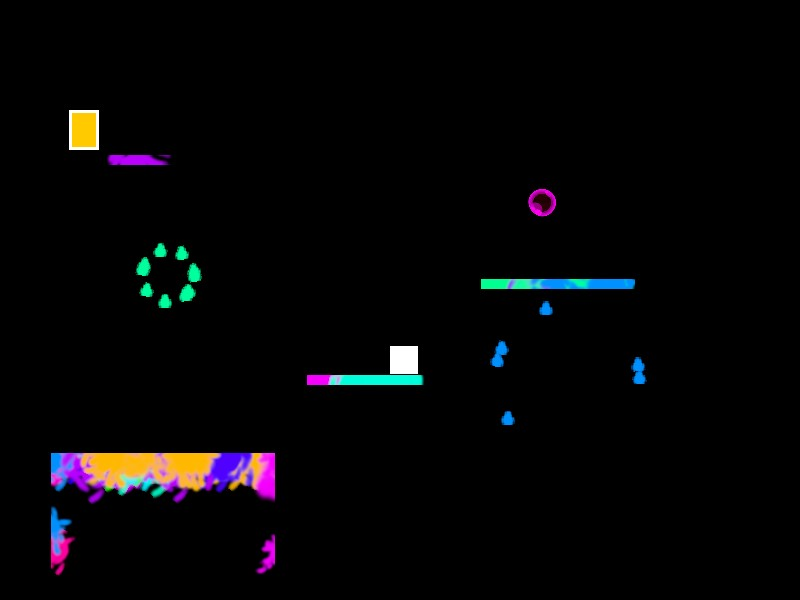

# Colorbubble

A Platformer with invisible platforms, use bubbles to splatter color everywhere and reveal them!

[Click here to play it!](http://firestar99.github.io/colorbubble)

* WASD / Arrow Keys / Space to move
* Shift / E / Q to create bubbles

Created during the Global Game Jam 2025 using [wgpu](https://wgpu.rs/), written in [Rust](https://www.rust-lang.org/). 

## Credit

Made by [Firestar99](https://github.com/Firestar99) and [Friz64](https://github.com/Friz64).

Bubble asset: https://lpc.opengameart.org/content/free-bubble-game-button-pack
